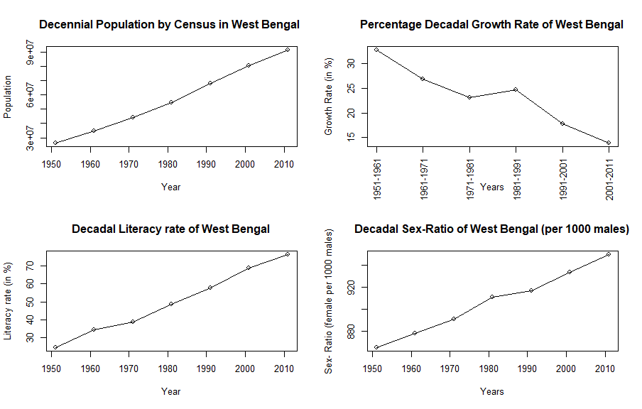
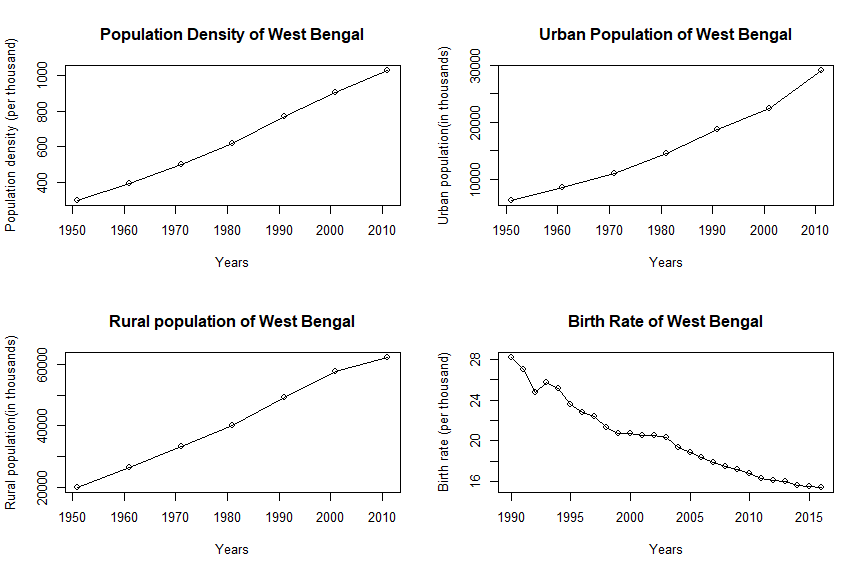
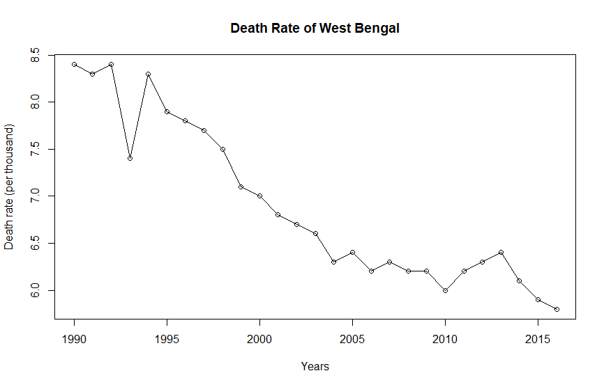

The state of West Bengal was created with the partition of India in 1947. Before obtaining independence from the British Raj in 1947, West Bengal was a part of the state of Bengal. Later, it was bifurcated and West Bengal and East Pakistan were formed. The diverse demography of West Bengal, erstwhile Bengal, was first enumerated in 1872. It was the first attempt at anything like a systematic enumeration of the people in that part of India. 

It has to be noted that data prior to the partition of India pertains to that of the united state of Bengal. After 1947, the data is on West Bengal, India only. Since the state has undergone major geographic changes before, this text focuses on the history of population of West Bengal after it was created in 1947 with India's independence and partition to keep the data comparable. 

The first census of West Bengal after its inception was conducted in 1951 and the last being in 2011. Every ten years, the census of West Bengal is conducted as a part of the Census of India. As per the Census of India, 2011, West Bengal is the $4^{th}$ largest state of India in terms of its population.

The following table summarizes the total population of West Bengal as recorded in the census of the corresponding years.

### Table 1: Decennial Population by Census in West Bengal

Year | 1951 | 1961 | 1971 | 1981 | 1991 | 2001 | 2011
-----|------|------|------|------|------|------|-----
Population| 26,300,670 | 34,926,000 | 44,312,017 | 54,580,650 | 68,077,970 | 80,221,300 | 91,347,736

The population is increasing in West Bengal over the years from 1951 to 2011.

\newpage

### Table 2: Decennial Population Growth (in percentage) by Census in West Bengal

Year| 1951-1961 | 1961-1971 | 1971-1981 | 1981-1991 | 1991-2001 | 2001-2011
---|---|---|---|---|---|---
Growth rate (in %)| 32.80 | 26.87 | 23.17 | 24.73 | 17.84 | 13.87

The population growth rate in West Bengal is on the wane in general from 1951, except for a spike in the decade 1981-1991.

### Table 3: Decadal Literacy Rate of West Bengal

Year | 1951 | 1961 | 1971 | 1981 | 1991 | 2001 | 2011
-----|------|------|------|------|------|------|-----
Literacy rate (in %) | 24.61 |34.46 |38.86 |48.65 | 57.70 | 68.64 | 76.26

The literacy rate in West Bengal is growing over the years.

### Table 4: Decadal Sex-Ratio of West Bengal (female per 1000 males)

Year| 1951| 1961 | 1971|1981|1991|2001|2011
---|---|---|---|---|---|--|---
Sex-ratio | 865 |	878	| 891 |	911 |	917 |	934 |	950

The sex-ratio of West Bengal, i.e., number of female per 1000 males has been rising steadily over the years.

### Table 5: Decennial Population Density (per sq. Km) of West Bengal

Year| 1951| 1961 | 1971|1981|1991|2001|2011
---|---|---|---|---|---|--|---
Population density| 296  | 394| 499 | 615 | 767| 903 | 1028

The population density of West Bengal has almost quadrupled from 1951 to 2011 and is on the rise.
\newpage

### Table 6: Urban Population of West Bengal

Year| 1951| 1961 | 1971|1981|1991|2001|2011
---|---|---|---|---|---|--|---
Total (in thousands)|6282 |8541| 10967 |14447 |18708 |22427 |29093

The urban population is increasing in West Bengal.

### Table 7: Rural Population of West Bengal

Year| 1951| 1961 | 1971|1981|1991|2001|2011
---|---|---|---|---|---|--|---
Total (in thousands)|20018| 26385| 33345| 40134| 49370| 57749| 62183

The rural population is increasing in West Bengal.

### Table 8: Birth Rate of West Bengal

Year| 1990| 1991| 1992 |1993 |1994| 1995| 1996| 1997| 1998
---|---|---|---|---|---|---|---|---|---
Birth rate (per thousand)|28.2| 27.0| 24.8 |25.7| 25.2| 23.6| 22.8| 22.4| 21.3

Year| 1999| 2000| 2001| 2002| 2003| 2004| 2005| 2006| 2007
---|---|---|---|---|---|---|---|---|---
Birth rate (per thousand)|20.7| 20.7| 20.5| 20.5| 20.3| 19.3| 18.8| 18.4| 17.9

Year| 2008| 2009| 2010| 2011| 2012| 2013| 2014| 2015| 2016
---|---|---|---|---|---|---|---|---|---
Birth rate (per thousand)|17.5| 17.2| 16.8| 16.3| 16.1| 16.0| 15.6| 15.5| 15.4

The birth rate (per thousand) in West Bengal is decreasing on an average.

\newpage
### Table 9: Death Rate in West Bengal

Year| 1990| 1991| 1992 |1993 |1994| 1995| 1996| 1997| 1998
---|---|---|---|---|---|---|---|---|---
Death rate (per thousand)|8.4| 8.3 |8.4| 7.4 |8.3| 7.9| 7.8| 7.7| 7.5

Year| 1999| 2000| 2001| 2002| 2003| 2004| 2005| 2006| 2007
---|---|---|---|---|---|---|---|---|---
Death rate (per thousand)|7.1| 7.0| 6.8 |6.7 |6.6 |6.3| 6.4 |6.2 |6.3

Year| 2008| 2009| 2010| 2011| 2012| 2013| 2014| 2015| 2016
---|---|---|---|---|---|---|---|---|---
Death rate (per thousand)|6.2| 6.2| 6.0| 6.2| 6.3| 6.4 |6.1| 5.9| 5.8

The death rate is decreasing gradually.

Source: Handbook of Statistics on Indian States, Reserve Bank of India 2018-19

